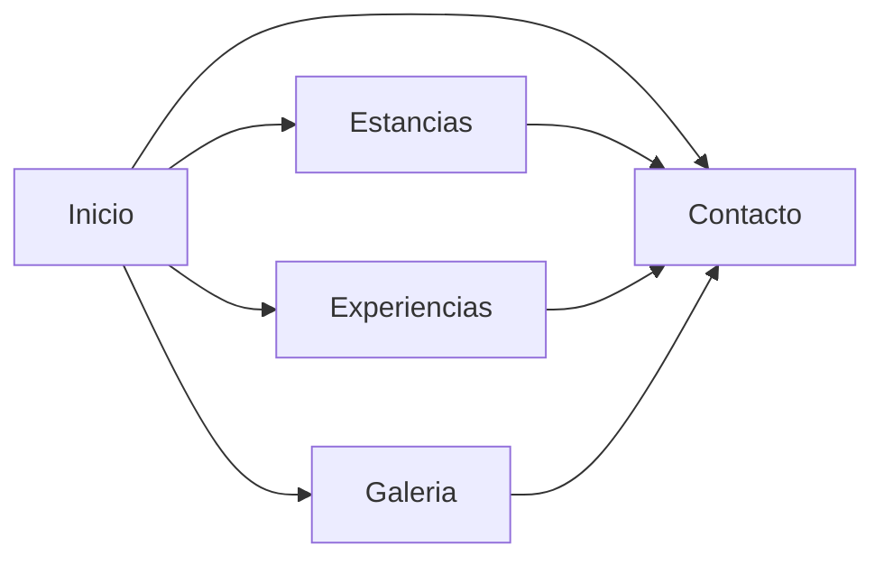

# Nuru Safari

Proyecto web de un hotel safari de lujo realizado con **HTML, CSS y JavaScript básico**.

## Páginas

- Inicio
- Estancias
- Experiencias
- Galería
- Contacto

## Componentes

Se han creado y reutilizado componentes como:

- Header y menú desplegable
- Botones
- Cards de alojamientos y experiencias
- Formularios
- Galería de imágenes
- Footer

## JavaScript

Se han añadido funcionalidades interactivas utilizando JavaScript básico:

- **Menú desplegable:** apertura y cierre del menú mediante un botón.
- **Header dinámico:** cambio de estilo al hacer scroll.
- **Hero automático:** cambio de imágenes cada 1,8 segundos.
- **Galería de estancias:** apertura de imágenes en un modal con navegación mediante botones o las flechas del teclado. Permite cerrar con la X o la tecla Escape.

## Navegación

## Cambios respecto al diseño

Se realizaron pequeños ajustes para adaptar el diseño a **tablet y móvil**, como cambios en los espacios, el tamaño de imágenes y vídeos, la distribución de algunos elementos y la galería responsive.
